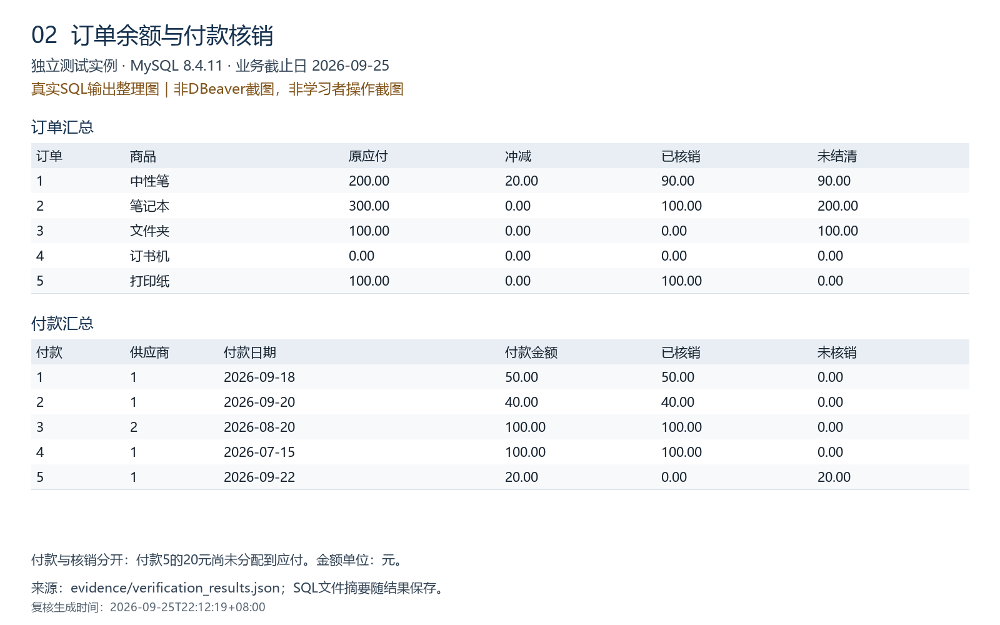

# 采购到付款业务流程模拟

面向ERP实施助理学习的个人MySQL模拟项目，覆盖采购订单、分批验收入库、应付确认、付款核销及采购退货。数据和企业名称均为虚构，脚本及文档由AI协助搭建，供学习者逐步运行、理解和改进，不代表真实客户实施、U8操作或生产系统。

目标仓库：`https://github.com/jxuexuz/p2p-sql-practice`。这是计划使用的地址，是否已发布应以GitHub页面为准。

## 范围和关键区别

- **5张核心表＋3张辅助表**，不是仅有5张表：供应商、采购订单、入库、应付、付款，以及退货、应付冲减、付款核销。
- 一张订单一种商品，一次入库最多确认一笔应付。支持分批入库、部分付款、同一付款核销多笔应付，同一应付由多次付款核销。
- 退货减少净收货数量；另外登记冲减才减少应付。付款记录表示资金支出，核销记录才表示清偿哪笔应付。
- 所有报表都是查询，不自动下单、付款、发票认证或阻止超量写入。外键保证引用存在，不保证所有业务规则成立。
- 人民币、不含税差和运费，不含付款退款、补货、取消订单、订单变更、会计凭证或并发控制。并非完整ERP。

## 示例结果

演示基准日为 **2026-09-25**；订单和当前余额报表汇总全部现有记录，账龄和及时率按脚本中明确的截止日期计算。

| 订单 | 商品 | 订购数量 | 累计入库 | 退货 | 净收货 | 原应付金额 | 冲减 | 已核销 | 未结清 |
| --- | --- | ---: | ---: | ---: | ---: | ---: | ---: | ---: | ---: |
| 1 | 中性笔（支） | 100 | 100 | 10 | 90 | 200 | 20 | 90 | 90 |
| 2 | 笔记本（本） | 50 | 30 | 0 | 30 | 300 | 0 | 100 | 200 |
| 3 | 文件夹（个） | 20 | 20 | 0 | 20 | 100 | 0 | 0 | 100 |
| 4 | 订书机（台） | 10 | 0 | 0 | 0 | 0 | 0 | 0 | 0 |
| 5 | 打印纸（包） | 10 | 10 | 0 | 10 | 100 | 0 | 100 | 0 |

未结清应付合计 **700－20－290＝390元**。已付款310元，其中290元已核销，20元尚未核销。不能把310全部从应付中再次扣除。不同单位的商品数量不汇总成“总库存”。

供应商1未结清90元，均在0—30天；供应商2未结清300元，其中31—60天200元、61天以上100元。供应商3无交易但保留显示。到期订单4笔，按时足量2笔，整体及时率50%；两家有订单供应商各50%，无到期订单供应商显示NULL（无适用分母）。

## 本地复现

目标环境MySQL 8.4，DBeaver，UTF-8；无需安装Python，也无需U8。使用本地测试库，勿连接生产环境。

1. 在DBeaver将编辑器关联到自己的本地MySQL连接。先运行：
   ```sql
   SELECT VERSION();
   SHOW DATABASES LIKE 'p2p_portfolio_demo';
   ```
   第二条应为0行。如果已有同名库，停止并核实，不要删除；可统一更换所有SQL中的库名。
2. `sql/01_schema.sql`：创建新演示库和8张表，仅执行一次。不要只选建表语句而跳过`USE`。如报错立即停止。原`inventory_practice`和`inventory_portfolio_demo`不受影响。
3. `sql/02_seed.sql`：执行`USE`、`START TRANSACTION`及全部INSERT；无错误才执行`COMMIT`，否则`ROLLBACK`。核对表行数为 **3、5、5、5、5、1、1、5**。
4. `sql/03_views.sql`：首次创建3个汇总视图，仅执行一次。视图不是业务数据表。
5. `sql/04_order_and_payment_report.sql`：查询订单、付款和核销明细。核对上面的结果。
6. `sql/05_ap_aging.sql`和`sql/06_delivery_timeliness.sql`：每次都连同`SET`一起执行，避免截止日期丢失。
7. `sql/07_exception_checks.sql`：首次创建异常视图；正常数据异常0行，待办1行（付款5未核销20元）。以后只执行末尾SELECT，不重复CREATE VIEW。
8. `sql/08_acceptance_tests.sql`：三组只读验收应为12＋4＋5＝21行PASS。
9. 可选`sql/09_transaction_experiments.sql`：按块测试实际表中的异常和回滚。阅读注释后操作，不改成COMMIT。

01、02、03、07的初始化部分只能执行一次。04、05、06、08可重复查询。不要一键反复执行整个目录，遇到错误不要选择忽略继续。

## 文档

2026-09-25，学习者反馈01—09已执行且无报错；已有截图核实8张表、初始行数和订单余额。独立MySQL 8.4.11实例另行复核通过32组断言（包含08的21行PASS检查）。本机版本仍待查询确认；详见验证记录，勿混淆两种证据来源。

[查看7张统一尺寸的复核结果图及原始输出说明](evidence/README.md)。下图为真实SQL输出排版图，不是DBeaver操作截图：



- [业务规则和表结构](docs/01_business_and_schema.md)
- [分阶段学习和截图清单](docs/02_learning_guide.md)
- [测试预期与验收](docs/03_test_plan.md)
- [GitHub网页上传步骤](docs/04_github_upload.md)
- [解释提纲与简历用语](docs/05_interview_and_resume.md)
- [验证记录](docs/06_verification.md)

## 安全与真实性

没有账号、密码、真实银行资料或数据库连接配置。不要上传DBeaver工作区、数据库数据目录、个人简历或验证码截图。`.gitignore`不能替代手动审查，网页上传时仍需检查文件列表。

只有在自己复跑并能解释后，才把成果写入已完成项目；上传后再写“已发布GitHub”。请保留“个人模拟实践、AI协助”的边界。参考实现通过自动验证也不等于学习者已掌握或生产可用。
