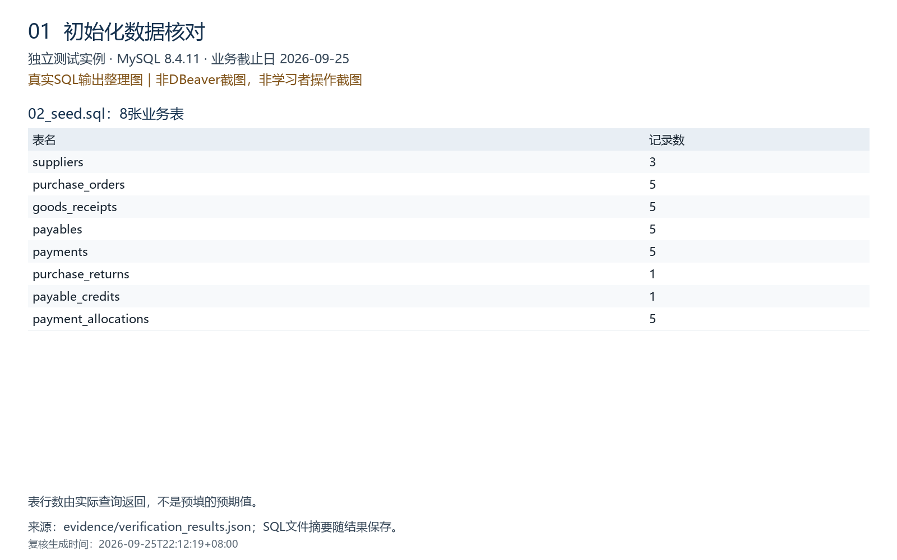
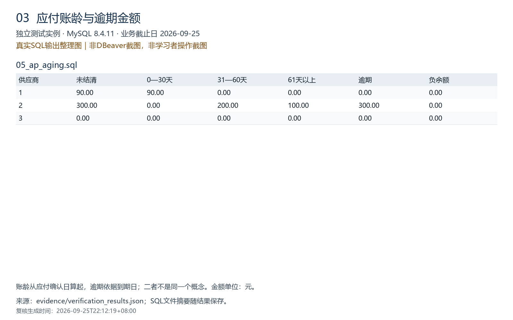
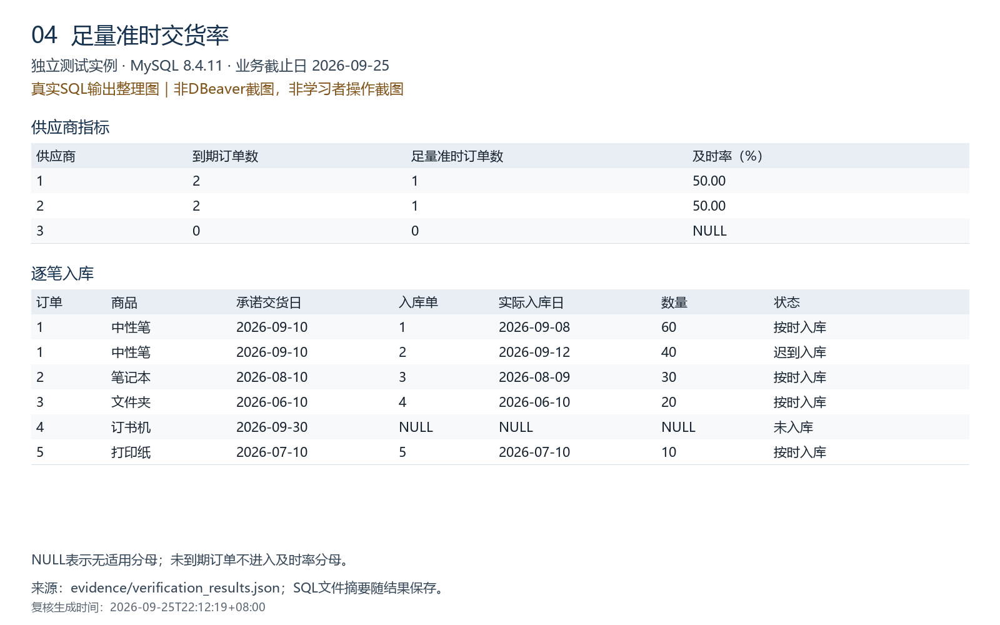
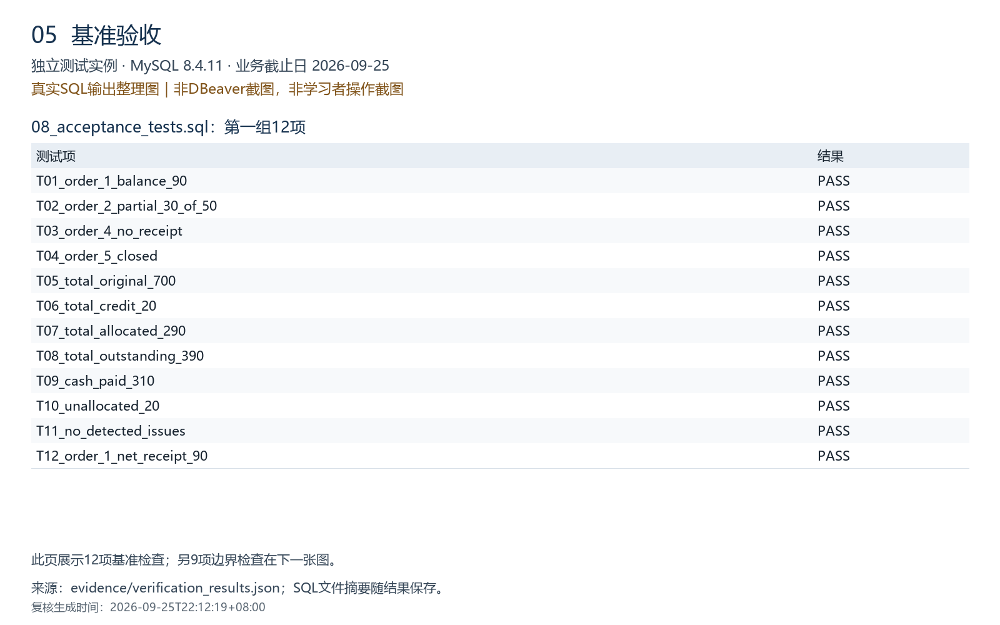
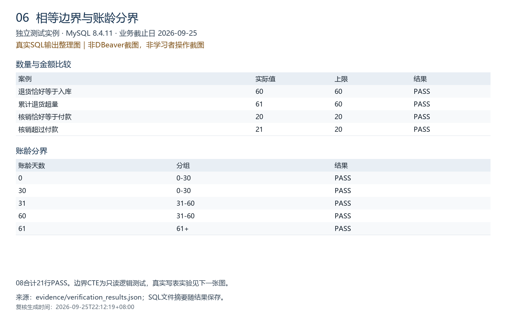
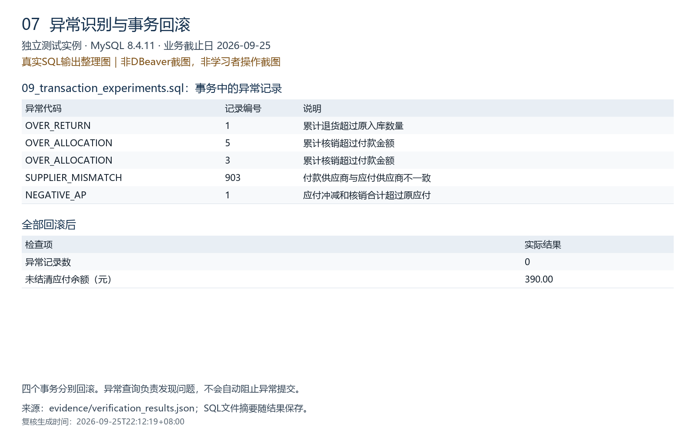

# 验证记录

## 生成方自动验证

2026-09-25，在本机单独创建的MySQL **8.4.11** 临时实例执行01—09全部SQL文件。该实例禁用TCP网络及MySQL X，通过随机命名的本地共享内存连接；没有连接或更改学习者原有MySQL服务及练习数据库。测试后临时实例已停止，临时数据文件留在工作区，不包含在发布包中。

结果：**32组自动断言通过**，其中一组验证08输出的21行全部PASS；数量不应理解成32＋21个互不重叠的独立业务用例。

覆盖内容：

- 8张表行数、逐订单余额、应付多次核销、付款跨多笔应付、未核销付款。
- 基准日账龄，以及9月10日、9月19日两个历史截止日排除后续事件的结果。
- 到期订单及时率分母，以及无到期订单的NULL比例。
- 09事务实验的异常代码及回滚后恢复390元。
- 退货恰好等于入库、核销恰好等于付款的合法边界。
- 超量入库、应付金额不符、退货冲减单据错配、冲减金额不符、各类日期顺序问题。
- MySQL拒绝重复主键、不存在的外键、零数量、负付款金额、错误到期日、重复入库应付。
- 最终异常检查0行、应付余额390保持不变。

自动检查不等于学习者已亲自完成，不替代生产可用性验证。日期重算不支持恢复修改前的历史记录。查询不能阻止业务异常写入。

## 学习者复跑记录

当前状态：**学习者反馈已执行01—09，未出现错误；初始化和订单汇总有截图佐证。**“执行无报错”与“每项结果符合预期”分开记录。

- 实际运行日期：2026-09-25。
- 客户端：DBeaver 26.2.0（依据运行截图）。
- 学习者本机MySQL版本：待确认。尚未提供 `SELECT VERSION();` 的结果；上文8.4.11仅指独立测试实例。
- 数据库名：`p2p_portfolio_demo`，建表结果标题和订单查询限定库名均可佐证。
- GitHub目标地址：`https://github.com/jxuexuz/p2p-sql-practice`；实际发布状态和提交日期待上传后记录。

### 核对结果

| 核对项 | 预期与独立复核结果 | 学习者侧证据 |
| --- | --- | --- |
| 表结构 | 8张业务表 | 21:46截图已核实表名及数量 |
| 初始行数 | suppliers / purchase_orders / goods_receipts / payables / payments / purchase_returns / payable_credits / payment_allocations：3 / 5 / 5 / 5 / 5 / 1 / 1 / 5 | 21:50截图已核实 |
| 订单1—5未结清余额 | 90 / 200 / 100 / 0 / 0元，合计390元 | 21:54截图已核实 |
| 应付和付款 | 原应付700－冲减20－核销290＝390元；付款310元，其中20元未核销 | 反馈执行无报错，尚未提供此项结果截图 |
| 截至09-25的账龄 | 0—30天90元，31—60天200元，61天以上100元；逾期300元 | 反馈执行无报错，尚未提供此项结果截图 |
| 到货及时率 | 到期4单、按时足量2单，50%；无到期订单供应商比例为NULL | 反馈执行无报错，尚未提供此项结果截图 |
| 异常和待办 | 基准数据异常0行；付款5未核销20元，为待办而非数据异常 | 反馈执行无报错，尚未提供此项结果截图 |
| 08验收 | 12＋4＋5＝21行PASS | 反馈执行无报错，尚未逐项核实学习者结果 |
| 09事务实验 | 4个实验检出相应异常；回滚后异常0行、余额恢复390元 | 反馈执行无报错，尚未提供回滚后结果截图 |

### 遇到的问题与处理

1. 环境检查时，将 `SELECT VERSION();` 和 `SHOW DATABASES LIKE 'p2p_portfolio_demo';` 一起作为单条查询执行，出现1064语法错误，错误输出还带有客户端追加的LIMIT。处理方式是分别选中完整语句执行；批量执行应使用脚本执行方式。随后完成建表、数据初始化及后续脚本运行。
2. 工具栏曾显示旧练习库名。不能仅凭工具栏推断执行库；应先执行 `USE p2p_portfolio_demo;`，再单独执行 `SELECT DATABASE();` 确认，也可在查询中使用完整库名。已有结果标题和限定库名的订单查询证明上述截图查询了新演示库。
3. 原始截图大小不统一。补充以下统一尺寸的SQL结果展示图用于阅读，保留其独立复核来源，不将其描述为学习者DBeaver操作截图。

## 本次补充的复核证据

2026-09-25重新执行独立复核，32组自动断言通过。原始输出记录生成时间为2026-09-25 22:12:19（UTC+08:00）。7张图均为1600×1000，由真实SQL输出排版生成，**不是DBeaver界面截图，也不是学习者本机运行截图**。

原始结果及9个SQL文件的SHA-256记录见 [verification_results.json](../evidence/verification_results.json)；来源与重新制图说明见 [证据说明](../evidence/README.md)。该记录不是第三方审计证明，也不代表生产环境测试。

### 1. 建表与数据行数

### 2. 订单余额与付款核销

### 3. 应付账龄

### 4. 到货及时率

### 5. 基准验收

### 6. 边界验收

### 7. 事务异常与回滚

## 待补充

- 学习者单独执行 `SELECT VERSION();`，补充本机准确版本，不复制独立测试实例版本。
- 发布后记录实际仓库地址和提交日期。
- 若需将04—09标为“学习者逐项核对通过”，还应逐项比对上述预期，而不只检查是否报错。
